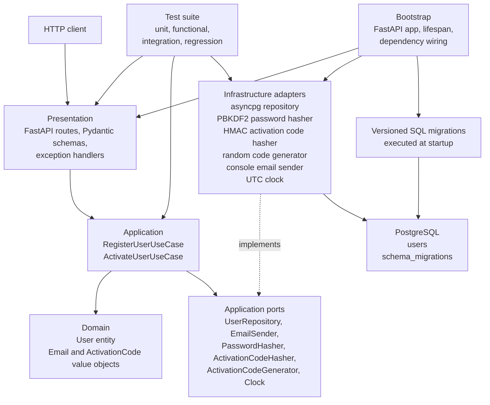
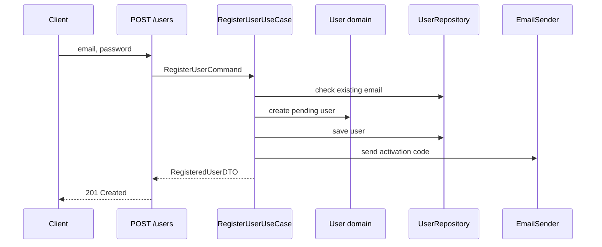
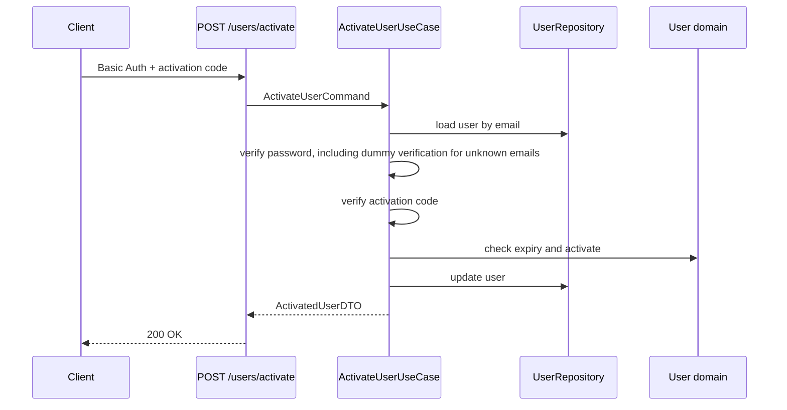

# Architecture

This service implements a user registration and activation API with Clean
Architecture. The central rule is that business decisions live in the domain and
application layers, while FastAPI, PostgreSQL, hashing, and email delivery remain
replaceable details.

## Component Schema



## Dependency Direction

Runtime dependencies point inward:

```txt
presentation -> application -> domain
infrastructure -> application ports
bootstrap -> all layers for wiring only
```

The domain layer does not import FastAPI, asyncpg, Pydantic settings, or
infrastructure code. Application use cases depend on protocols, not concrete
database, security, or email implementations. Infrastructure classes implement
those protocols.

## Layers

### Domain

Location: `src/domain`

Responsibilities:

- Represent the `User` aggregate and account status.
- Validate email and activation code value objects.
- Enforce activation invariants, including timezone-aware UTC timestamps.
- Keep business rules independent from transport, database, and configuration.

### Application

Location: `src/application`

Responsibilities:

- Expose use cases for registration and activation.
- Define command objects and output DTOs.
- Define ports for persistence, email, hashing, code generation, and time.
- Translate domain and workflow failures into explicit application exceptions.

### Presentation

Location: `src/presentation`

Responsibilities:

- Define FastAPI routes.
- Validate HTTP request bodies with Pydantic schemas.
- Return response schemas.
- Use FastAPI `Depends` for dependency injection.
- Register exception handlers for stable HTTP error responses.

Routes intentionally stay thin: they map HTTP input to application commands,
call a use case, then map DTOs to HTTP responses.

### Infrastructure

Location: `src/infrastructure`

Responsibilities:

- Manage the asyncpg PostgreSQL pool.
- Execute raw SQL queries against PostgreSQL.
- Run versioned SQL migrations without Alembic.
- Hash passwords with PBKDF2-HMAC-SHA256.
- Generate numeric activation codes.
- Hash activation codes with HMAC-SHA256 before persistence.
- Send activation emails through a replaceable email adapter. The assessment
  implementation prints the code to the console, which keeps the third-party
  boundary explicit without requiring an external provider.

### Bootstrap

Location: `src/bootstrap`

Responsibilities:

- Create the FastAPI application.
- Register routers and exception handlers.
- Create long-lived infrastructure adapters during lifespan startup.
- Run SQL migrations before serving requests.
- Close the PostgreSQL pool during shutdown and on startup failure.
- Expose request dependencies that reuse startup state.

## Main Runtime Flows

### Registration



The database has a unique constraint on email. The repository translates unique
constraint violations into an application error so concurrent duplicate
registrations remain predictable.

### Activation



Activation codes expire after one minute. Date comparisons require timezone-aware
UTC datetimes so local or naive datetime mistakes fail fast.

## Database

The service uses PostgreSQL only. SQLite is not used anywhere.

The application schema is created by versioned SQL files in
`src/infrastructure/database/migrations`. Startup executes migrations in
filename order and records applied versions in `schema_migrations`.

Migration execution is serialized with a PostgreSQL advisory lock, which protects
startup migrations when several application instances start against the same
database.

## Tests

The test suite is labelled with pytest markers:

- `unit` covers application use cases with in-memory doubles.
- `functional` covers FastAPI routes and HTTP error mapping.
- `integration` covers asyncpg repositories and PostgreSQL persistence.
- `regression` protects previously fixed edge cases.

Docker Compose provides a dedicated `test` service and an isolated
`user_registration_test` database. Integration tests truncate their tables before
and after each run, so the application database is not modified by tests.
